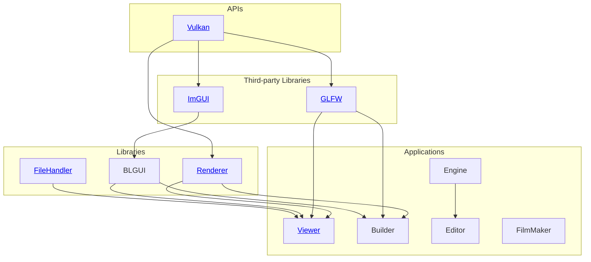

# Welcome to Brick Labs

```mermaid
graph TD
    
    subgraph APIs
        style APIs fill:#ffc
        Vulkan[<a href="https://vulkan.org">Vulkan</a>]
    end

    subgraph Third-party Libraries
        GLFW[<a href="https://www.glfw.org">GLFW</a>]
        ImGUI[<a href="https://github.com/ocornut/imgui">ImGUI</a>]
    end

    subgraph Libraries
        Renderer[<a href="https://github.com/Brick-Labs/Renderer">Renderer</a>]
        FileHandler[<a href="https://github.com/Brick-Labs/FileHandler">FileHandler</a>]
        BLGUI
    end

    subgraph Applications
        Viewer[<a href="https://github.com/Brick-Labs/Viewer">Viewer</a>]
        Builder
        Engine
        Editor
        FilmMaker
    end

    %% APIs to Libraries
    Vulkan --> Renderer
    Vulkan --> GLFW
    Vulkan --> ImGUI

    %% Libraries to Libraries
    ImGUI --> BLGUI

    %% Librararies to Applications
    Renderer --> Viewer
    Renderer --> Builder

    GLFW --> Viewer
    GLFW --> Builder

    BLGUI --> Viewer
    BLGUI --> Builder

    FileHandler --> Viewer

    %% Applications to Applications
    Engine --> Editor
```

This chart shows the various projects this organization is working on and its external dependencies.
