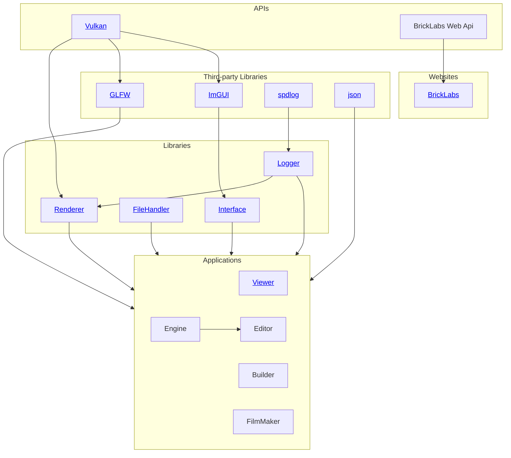

# Welcome to Brick Labs
Welcome to **Brick Labs** – an organization dedicated to building software that revolves around **bricks**.  
Our projects focus on creativity, construction, and digital tools for everyone who loves to build with bricks – virtually or in real life.  

## Projects

*This chart shows the various projects this organization is working on and its external dependencies.*

## Requirements 
These requirements apply to all projects created by this organization.
- **Cross-platform**: All programs will be designed to work on multiple platforms, including Windows, Linux, and macOS.
- **Abstraktion**: Any function that is used in multiple programs should, if possible, be implemented in the form of a library to avoid duplicate code.

## Contributing  
We welcome contributions from the community!  
- Fork a project and submit a Pull Request  
- Open an Issue with ideas or bug reports  
- Join discussions about new features  

👉 Check our [Contribution Guidelines](../.github/CONTRIBUTING.md) 

## License  
All projects are licensed under the [MIT license](https://opensource.org/license/mit), with a few exceptions. Please refer to the individual repositories for more information.

## Community  
- Follow our projects here on GitHub and on our [Website](https://brick-labs.org)
- Share your ideas and suggestions via Issues  
