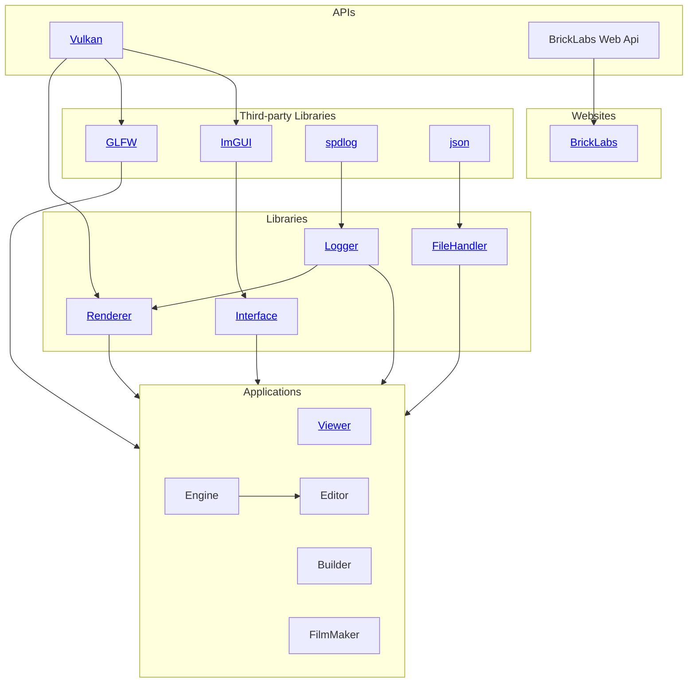

# Welcome to Brick Labs
Welcome to **Brick Labs** – an organization dedicated to building software that revolves around **bricks**.  
Our projects focus on creativity, construction, and digital tools for everyone who loves to build with bricks – virtually or in real life.  

## Projects

*This chart shows the various projects this organization is working on and its external dependencies.*
